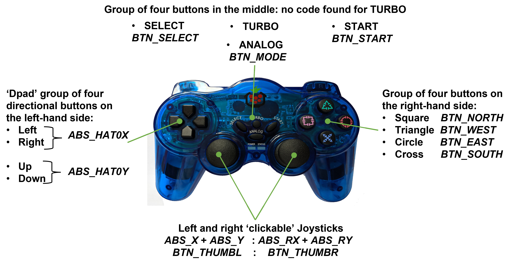
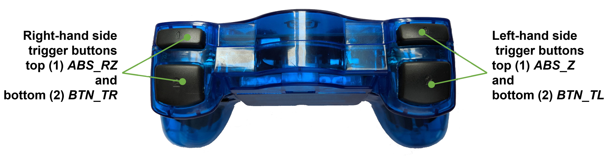

# Wireless controller/gamepad usage
Simple Python test code to show how a PiHut wireless controller/gamepad can be connected to a Raspberry Pi for usage such as controlling a robot.

Details of a robotics project that uses the PiHut controller can be found at:
https://onlinedevices.org.uk/Flexible+Design+Raspberry+Pi+system+controller+software

Exploration code examples are underpinned by the cross-platform Python 'inputs' module from:
 https://github.com/zeth/inputs

The images below show the 'codes' that are 'generated' with the 'use' of each of the (many!) buttons and other control features of the PiHut wireless controller (available at https://thepihut.com/products/raspberry-pi-compatible-wireless-gamepad-controller)

The test code examples show how:
- the 'generated' code for a button/feature can be shown;
- each of the 19 'generated' codes that have been found for the PiHut controller can be detected and acted upon;
- just the left joystick of the PiHut controller can be used to 'drive' a Raspberry Pi managed robot that uses the L298N motor controller.